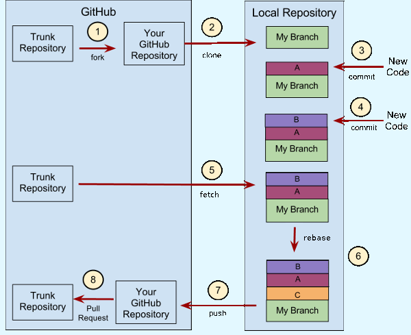

# 文档及代码协作指南

本文档从『发起 Pull Request』和『管理 Pull Request』两方面来描述使用 Git 进行团队间文档、代码协作的工作流，以及在工作流中需要遵守的各项规范。但并不提及 Git 的使用原理，涉及 Git 有关命令时也不对其进行详细介绍。在阅读本文档前，请确保你已经阅读过 [廖雪峰的 Git 教程](http://www.liaoxuefeng.com/wiki/0013739516305929606dd18361248578c67b8067c8c017b000)。

---

<!-- vscode-markdown-toc -->
* 1. [协作机制](#-0)
	* 1.1. [Issue](#Issue-1)
	* 1.2. [Pull Request](#PullRequest-2)
* 2. [发起 Pull Request](#PullRequest-3)
	* 2.1. [搭建协作环境](#-4)
		* 2.1.1. [注册 GitHub 帐号](#GitHub-5)
		* 2.1.2. [安装和配置 Git](#Git-6)
		* 2.1.3. [Fork GitHub 仓库、初始化本地仓库](#ForkGitHub-7)
	* 2.2. [建立新分支](#-8)
	* 2.3. [在分支上工作](#-9)
	* 2.4. [发起 Pull Request](#PullRequest-10)
	* 2.5. [更新 Pull Request](#PullRequest-11)
	* 2.6. [删除分支](#-12)
	* 2.7. [如果你遇到问题](#-13)
* 3. [管理 Pull Request](#PullRequest-14)
	* 3.1. [Code Review](#CodeReview-15)
	* 3.2. [网页直接合并](#-16)
	* 3.3. [拉取本地合并](#-17)
		* 3.3.1. [拉取](#-18)
		* 3.3.2. [合并 PR 的所有内容](#PR-19)
		* 3.3.3. [合并 PR 的部分内容](#PR-20)
	* 3.4. [commit message 规范](#commitmessage-21)
	* 3.5. [PR 合并之后](#PR-22)

<!-- /vscode-markdown-toc -->

---

##  1. <a name='-0'></a>协作机制

在本次课程设计中，我们使用 GitHub 作为文档和代码的托管平台，并使用其自带的协作机制：Issue and Pull Request。（如果你感兴趣，可以看一看 [GitHub Help/Collaborating with issues and pull requests](https://help.github.com/categories/collaborating-with-issues-and-pull-requests/)）

###  1.1. <a name='Issue-1'></a>Issue

文档或代码存在的 问题/Bug 要通过发起 issue 来提出。

QQ 群的时效性、随意性较强，难以翻查每个人提出的意见，不适合作为问题讨论的地方。发起 Issue 后可以通过 QQ 来通知大家，但严禁只在 QQ 群里面提出文档或代码存在的问题。Issue 区也仅存放文档或者代码存在的问题，禁止无意义灌水。

###  1.2. <a name='PullRequest-2'></a>Pull Request

一切对文档、代码总仓库的实际改动都要通过发起 pull request（或简称 PR）来实施。

使用 pull request 有如下好处：

1. 分离个人与总仓库，防止误操作导致总仓库损坏。
1. 方便 code review。每一个 pull request 在 GitHub 上都有一个可以用来讨论（a.k.a. code review）的页面。
1. 持续更新。pull request 并不是一旦发起就固定了，发起者可以通过更新自己 GitHub 账户下的分支来使其自动更新。

发起 pull request 的过程在『发起 Pull Request』中描述。

##  2. <a name='PullRequest-3'></a>发起 Pull Request

小组间协作的过程就是一个不断新建分支，提交 commit，发起 pull request 的过程。

- 在文档库建设及系统分析与设计阶段：指定的人草拟出文档框架之后，大家通过 pull request 来对其进行补充、修改、或者重构。具体的文档写作与修改规则，参见『文档写作指南.md』。
- 在编码阶段：组长会给大家分配任务。其中每个任务都需要自己在本地建一个不同于 master 的新分支，并在其上工作。任务完成之后手动 push 分支到 GitHub 上，发起 pull request。

下面借用稍加修改的 [阮一峰的图](http://www.ruanyifeng.com/blog/2015/08/git-use-process.html) 来表示这个发起 pull request 的工作流：



###  2.1. <a name='-4'></a>搭建协作环境

在进行实际的文档写作和代码编写之前需要先搭建环境，进行一些前期准备工作。

####  2.1.1. <a name='GitHub-5'></a>注册 GitHub 帐号

1. 在 [GitHub](www.github.com) 上注册帐号，并注意以下事项：

	- 使用英文 username。如果没有，现在选择一个。
	- 使用非 QQ 邮箱，邮箱名要与用户名形成对应关系。Git 以邮箱作为用户标识，使用纯数字邮箱名导致无法一眼看出邮箱所属者，这会给以后文档、代码管理审查工作带来麻烦。

1. 在注册完成并验证邮箱后，完善 GitHub 个人资料。

	在 Profile / Public profile 中填写 Name 一项后点击 `Update profie` 。这个 Name 可以和上面填写的 username 不同，但要保证在课程设计过程中不再更改此 Name。

####  2.1.2. <a name='Git-6'></a>安装和配置 Git

1. 从 [git 官网](https://git-scm.com/) 上下载 Git for Windows，并以默认选项安装。
1. 熟悉 Git Bash。Git for Windows 自带 `Git Bash` `Git CMD` `Git GUI` 三种用户界面。在本次课程设计中，我们只使用 `Git Bash`。在实际进行 Git 相关操作以前，熟悉 `Git Bash` 并调整的字体大小以及默认窗口大小满意自己喜好。
1. 生成 SSH Key 并添加到自己的 GitHub 帐号中，具体的步骤参见 [廖雪峰的 Git 教程/远程仓库](http://www.liaoxuefeng.com/wiki/0013739516305929606dd18361248578c67b8067c8c017b000/001374385852170d9c7adf13c30429b9660d0eb689dd43a000)。
1. 使用 VS Code 新建文件 `C:\Users\<your-win-username>\.gitconfig`，并填入如下内容：

	在 `name` 一项后面写上你在 GitHub Profile 中填写的 Name，在 `email` 一项后面写上注册 GitHub 时候使用的邮箱。

```
[user]
	name =
	email =
[core]
	editor = code --wait
	safecrlf = true
	quotepath = false
[alias]
	lg = log --color --graph --pretty=format:'%Cred%h%Creset -%C(yellow)%d%Creset %s %Cgreen(%cr) %C(bold blue)<%an>%Creset' --abbrev-commit
```

####  2.1.3. <a name='ForkGitHub-7'></a>Fork GitHub 仓库、初始化本地仓库

以文档库为例：

1. 使用浏览器打开宝琛 GitHub 账户下的 [文档库](https://github.com/c-rainstorm/OnlineShoppingSystem-Documents)，点击右上角 Fork，将文档库 fork 到自己的 GitHub 账户下。
1. 在你喜欢的本地位置，使用『右键 -> Git Bash Here』，进入 Git Bash，运行以下命令：

	> $ git clone -o trunk https://github.com/c-rainstorm/OnlineShoppingSystem-Documents doc

1. 进入 `doc` 目录，运行以下命令：

	> $ git remote add myfork {your-github-fork-address}

代码库在本地要使用 eclipse workspace 下的 src 文件夹，即将 clone 命令最后一个参数 `doc` 改为 `src`。

在前期准备工作完成以后就可以在『建立新分支 -> 在分支上工作 -> 发起 pull request -> 更新 pull request -> 删除分支』的工作流上循环了。如果你对 Git 了解不深，请严格按照工作流顺序执行，否则可能出现自己无法解决的问题。

###  2.2. <a name='-8'></a>建立新分支

接到开发任务或发现文档或者代码的存在问题，自己决定对远程文档、代码总仓库进行修改**之前**要新建本地分支。

新建本地分支时本地有以下两种情况和对应要使用的命令：

1. 你已经完成手头所有工作，当前工作目录干净，当前分支为 master，与远程文档、代码总仓库同步情况未知。

	此时，**顺序执行**下面的命令同步本地 master 分支和建立新分支：

	> 关闭你所有的文档代码编辑器
	>
	> $ git fetch trunk
	>
	> $ git rebase trunk/master master
	>
	> $ git checkout -b {new-branch-name} trunk/master

1. 你正工作在另一个分支上，当前工作目录保存着你正在工作的内容，当前分支不是 master，与远程文档、代码总仓库同步情况未知。

	此时，**顺序执行**下面的命令同步本地 master 分支和建立新分支：

	> 关闭你所有的文档代码编辑器
	>
	> $ git commit -a -m "切换分支，临时保存"  # 如果当前工作目录不干净
	>
	> $ git fetch trunk
	>
	> $ git rebase trunk/master master
	>
	> $ git checkout -b {new-branch-name} trunk/master

###  2.3. <a name='-9'></a>在分支上工作

在分支上工作是一个不断在本地『更改文件、提交 commit』的过程。

更改文件时注意以下事项：

1. 禁止在 master 分支上工作。
1. 一个分支只用来开发一个特性或修复一个问题。禁止在一个分支里面存在多个不相关的任务或问题更改。如果需要做另一个任务或修复另一个问题/bug，先新建分支。
1. 做完任务的一个小阶段之后就立即提交 commit，以避免误操作导致更改丢失。

提交 commit 时注意以下事项：

1. 所有相关命令在文档库或代码库根目录下执行。
1. 手动对进行文档，代码格式化。文档格式化参见『文档写作指南.md』，代码格式化使用 IDE 自带格式化功能。
1. 使用 `$ git status` 和 `$ git diff` 查看引入的变化，确保没有引入『不合规范的更改』。

	『不合规范的更改』包括：

	1. 不符合『文档写作指南』的文档修改。
	1. 不符合『编码规范』的代码修改。
	1. 对任务或问题所在文本区域以外文本区域的更改。
	1. 行尾存在空格的行。
	1. 与此次修改无关的临时文件。

1. 尽量使用中文和有意义的 commit message。清晰的历史记录和有意义的 commit message 可以方便代码审查和讨论。

###  2.4. <a name='PullRequest-10'></a>发起 Pull Request

你在分支上工作这一段时间里，其他人或已经向总仓库提交了更改，导致本地分支与远程 trunk/master 分支不同步。在实际发起 pull request 前，顺序执行以下命令，使本地与远程两 master 分支同步，使正工作的分支与远程 trunk/master 分支同步。

> 关闭你所有的文档代码编辑器
>
> $ git fetch trunk
>
> $ git rebase trunk/master master
>
> $ git rebase master {your-working-branch}

如果上面的命令执行过程中没有出现问题，再执行以下命令，将修改推送到 GitHub 自己帐号下：

> $ git push myfork {your-working-branch}

推送到 GitHub 自己帐号下之后，在 GitHub 网站上手动点击 pull request 按钮，发起 pull request。至此，这一步就结束了。

###  2.5. <a name='PullRequest-11'></a>更新 Pull Request

修改推送到 GitHub 之后，要经过代码审查与讨论，才可以被合并入总仓库。这个时候组内的其他人可以对你的代码进行讨论和评价。这个阶段，大家可能会发现你的 pull request 存在问题。

如果你决定修改这个 pull request，而你现在本地仓库不在这个分支上，**顺序执行**以下命令切换到 pull request 对应的分支：

> 关闭你所有的文档代码编辑器
>
> $ git commit -a -m "切换分支，临时保存"  # 如果当前工作目录不干净
>
> $ git checkout {branch-to-be-revised}

如果你正处于这个分支上，直接进行修改即可。

切换分支并进行修改并 commit 后使用以下命令来更新 pull requst:

> $ git push myfork {revised-branch}

注意：当且仅当 pull request 处于打开状态下才可以对 pull request 进行更新。Pull request 的状态在 GitHub 总仓库对应页面上可以看到。

###  2.6. <a name='-12'></a>删除分支

pull request 被关闭的时候，对应分支的生命周期就结束了。一旦 pull request 被总仓库管理者关闭，即要**马上**使用以下命令删除本地分支：

> $ git branch -D {expired-branch}

并在自己 GitHub 账户下手动删除分支

最后后，再在本地运行以下命令删除本地已过期的 remote-tracking branches。

> $ git remote prune myfork

以：

- 保持本地与 GitHub 仓库分支处于可控状态。
- 避免出现 pull request 已经关闭了，自己仍对其相应分支进行编辑的情况。

###  2.7. <a name='-13'></a>如果你遇到问题

你可能会遇到如下情况：

- 在分支处于 A 状态下，做了应该属于分支 B 的修改。
- 合并分支时候，遇到冲突。
- Pull request 关闭之后，又对对应的分支作了修改。

你有两种方法来解决这些问题：

1. 参考 [廖雪峰的 Git 教程](http://www.liaoxuefeng.com/wiki/0013739516305929606dd18361248578c67b8067c8c017b000/001374831943254ee90db11b13d4ba9a73b9047f4fb968d000)，但请不要胡乱尝试。廖雪峰的 Git 教程上有一些命令是相当危险的，请确保你完全理解其所使用的 Git 命令的意义之后再动手。在最怀的也是最常发生的情况下你将丢失你正在工作的所有内容，且不可恢复。这意味着你要再写一遍。
1. 请求张宝琛或张健淳协助。

##  3. <a name='PullRequest-14'></a>管理 Pull Request

管理 PR 的任务主要由张宝琛与张健淳完成。

###  3.1. <a name='CodeReview-15'></a>Code Review

Code review 由两人共同完成，只要有一人在 PR 下标明『PR 没有问题，可以引入』，CR 过程即可结束。

注意：

1. 如果自己决定处理这个 PR，必须在 PR 下标明意向和日期，如『计划于 11/18 合并此 PR』，以避免两人同时对同一个 PR 进行处理，造成冲突和时间浪费。
1. Code review 时为保证能在邮件中直接知道是对谁 review，review 使用 @，@ 原作者。
1. Inline review 需要在文件比对右上角或切换到 Conversation 界面 submit review。

###  3.2. <a name='-16'></a>网页直接合并

『网页直接合并』用于且仅用于符合各项规范的 PR。

GitHub 提供三种网页合并方式：

1. **Create a merge commit** 除了将 PR 中若干个 commit 合并到 master 之上 以外还会会产生没有实际内容的空白 merge commit。禁止使用。
1. **Squash and merge** 其实是 Rebase 功能的一部分，用于将多个 commit 合并为一个 commit。此合并方式不会产生空白 merge commit，而且 GitHub 有提供重写 commit message，可以考虑使用。
1. **Rebase and merge** 将 PR 中若干 commit rebase 到 master 之上。和『Create a merge commit』的唯一区别就是不会产生没有实际内容的空白 commit，但仍无法避免 WIP（Work In Process）commit 的引入。避免使用。

###  3.3. <a name='-17'></a>拉取本地合并

在绝大多数情况下，需要拉取 PR 到本地进行一定处理后，才能将 PR 内容合并到总库 master 分支。

####  3.3.1. <a name='-18'></a>拉取

使用 *Pro Git* 第 6.3.3 节 Managing Pull Requests 小节讲解的 `ls-remote` 和 `fetch` 工具来识别和拉取 PR 到本地：

1. 识别： 从 GitHub 上找到要处理 PR 的编号。
1. 确认： 本地使用 `git ls-remote trunk` 列出在 trunk 仓库中存在的 PR。
1. 拉取： 使用 `git fetch trunk refs/pull/<pr#>/head` 拉取 PR 到本地，此时此 PR 在本地的引用为 `FETCH_HEAD`。
1. 分支： `FETCH_HEAD` 是一个 detached HEAD，当从 detached HEAD 切换到另一个分支的时候，所有在 detached HEAD 进行的 commit 都会丢失（Remote-tracking branch 和 *HEAD 都是 detached HEAD）。所以对拉到本地的 PR 进行修改时候，最好新建一个本地分支。分支可以使用 namespace 来组织，也就是说可以使用如 `dh/doc-fix-pr-2` 所示的形式，`dh` 为 namespace，`doc-fix-pr-2` 为分支名。

*Pro Git* 也介绍了一种 `fetch all of the pull requests` 的方法，这个根据个人喜好决定是否使用。

####  3.3.2. <a name='PR-19'></a>合并 PR 的所有内容

可以使用如下流程：

1. 同步 master 分支。由于有两人对 trunk 进行管理，可能导致自己本地与 trunk 两 master 分支不同步。
1. 重写分支的 commit。在进行重写前，最好先保持 commit log 和 message 不变，只先将其 rebase 到 master 分支上，以尽早发现可能存在的冲突问题。

	1. 确定要重写的范围（Pro Git section 7.1）：切换到相应分支，使用命令 `git log master..HEAD` 确定不在 master 分支上，但在当前分支上的 commits。
	1. 重写 commit（Pro Git section 7.6）：重写 commit 时，为保留 PR 的原作者，避免使用 `reset` 工具，而使用 `rebase -i master` 将 PR 重写为一个或若干个 commits，并重写 commit message。

1. 转移 commit 到 master。`rebase` 或者 `merge` 皆可。注意不要让 Git 生成没有实际内容的空白 commit，造成菱形的 log。
1. Push 前确认。在 push 到 trunk 仓库后，要尽量避免再强制 push，所以在 push 之前最好再次确认所 push 内容的正确性。可使用 `git diff trunk/master..master` 查看要引入的差异，使用 `git log --oneline --graph trunk/master..master` 查看要 push 的 commits。

####  3.3.3. <a name='PR-20'></a>合并 PR 的部分内容

处理和合并 PR 中的 commit 主要使用 rebase 命令。

1. 如果要合并部分 commit，而不修改 commit 内的内容的话，可以：

	- 使用 rebase -i，在 rebase 界面将不需要的 commit 的行删掉。
	- 或在 master 分支上使用 `cherry-pick` 将一个或多个 commit pick 到 master 分支上。

1. 如果要合并部分 commit，而且要对 commit 内的内容进行修改的话，可以：

	1. 在 rebase 界面中，将不需要的 commit 的行删掉。
	1. 在 rebase 界面中，对需要修改的 commit 使用 edit（e, edit = use commit, but stop for amending）command。

###  3.4. <a name='commitmessage-21'></a>commit message 规范

**前缀**：

1. 新内容，新特性使用 New：
1. 更正 bug，更正 typo 使用 Fix：
1. 对能运行的的代码或没有错误的文档进行修改使用 Improve：

**内容**：

1. 使用 \` \` 来引用名称，而不是 『』。『』 确实不太好看。
1. 内容中不再出现 修改，解决，提升 等词。

	- 正确：『Fix：失效的 \`HTTP 详解\` 链接』、『New：管理 PR 的章节』。
	- 错误：『Fix：更新了 \`HTTP 详解\` 的链接』、『New：新增管理 PR 的章节』。

1. 使用陈诉式的动词，
	- 正确：『更新』、『增强』、『修改』，
	- 错误：『更新了』、『增强了』、『修改了』。

**后缀**：

1. 使用 GitHub 标识 PR 的数字 n 加上英文括号作为后缀：(#n)。如果将多个 PR 合为一个，后缀要标明全部的 PR：(#n1 #n2)

###  3.5. <a name='PR-22'></a>PR 合并之后

PR 合并之后，及时关闭 PR，@ PR 作者以及相关人士。
