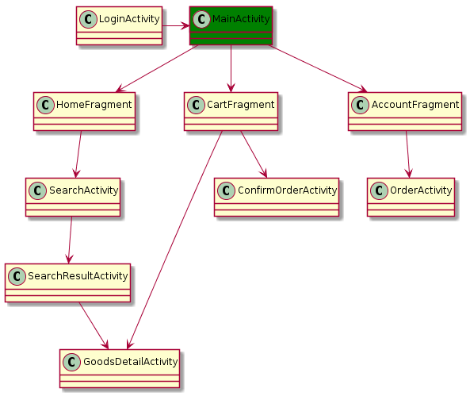

# Taobao Demo 实现说明

---

<!-- vscode-markdown-toc -->
* 1. [SDK 版本与兼容性](#SDK)
* 2. [界面](#)
	* 2.1. [ ScrollView 与 ListView/RecyclerView](#ScrollViewListViewRecyclerView)
	* 2.2. [2.2 尽可能简单](#-1)
* 3. [Fragment 实现注意](#Fragment)
* 4. [Activity 实现注意](#Activity)
* 5. [网络](#-1)
* 6. [任务分配](#-1)

<!-- vscode-markdown-toc-config
	numbering=true
	autoSave=true
	/vscode-markdown-toc-config -->
<!-- /vscode-markdown-toc -->

---

##  1. SDK 版本与兼容性

| | |
| --- | --- |
| SDK 最低版本 | API 19（Android 4.4） |
| SDK 目标版本 | API 23（Android 6.0） |
| SDK 编译版本 | API 23（Adnroid 6.0） |

以上这些 SDK 版本问题已在 `build.grandle` 中设置过了，编程时无需再显式指定。

##  2. 界面

下图画出了要实现的页面，没有画出来的都不实现。比如『收藏商品』，『个人资料』等。

Taobao Demo 打开首先进入 LoginActivity，登录后进入 MainActivity。MainActivity 默认显示 HomeFragment。当用户点击底部选项卡时，对应显示 CartFragment, AccountFragment。

###  2.1.  ScrollView 与 ListView/RecyclerView

有三种 ViewGroup 可以支持长于一个屏幕的页面：[ScrollView](https://developer.android.com/reference/android/widget/ScrollView.html)、[ListView](https://developer.android.com/reference/android/widget/ListView.html)、[RecyclerView](https://developer.android.com/reference/android/support/v7/widget/RecyclerView.html)。

『第一行代码』中介绍的是 ListView，『Android 编程权威指南』中介绍的是 RecyclerView，两者功能相似，使用时按照自己喜好。

###  2.2. 2.2 尽可能简单

淘宝手机 App 中有很多**短时间**内难以完成的界面设计，绘制界面时怎么简单怎么来，只要和淘宝相似就可以了。

##  3. Fragment 实现注意

**不能直接定义构造函数**

实现 Fragment 的子类时，不能自定义构造函数。要用 static T newInstance(...) 代替。具体原因牵涉到 Fragment 生命周期，我也不懂。

**CartFragment**

CartFragment 要实现 `onHiddenChanged()` 方法。`onHiddenChanged()` 方法会在从 HomeFragment、AccountFragment 跳转至此 fragment 时自动调用，这个时候，购物车内或已变化，理应刷新购物车。

##  4. Activity 实现注意

所有 Activity 都必须直接或间接继承于 AppCompatActivity。

其中：

- CartFragment 与 ConfirmOrderActivity 之间
- SearchResultActivity 与 GoodsDetailActivity 之间
- CartFragment 与 ConfirmOrderActivity 之间

有数据传递，实现时要先定义接口。

##  5. 网络

由于 Android 禁止在主线程内进行网络相关操作（若进行网络操作，就会抛出应用程序无法自处理的异常），此 Demo 计划使用一个 Http 辅助类 `HttpRequest`（便开工，边由董豪实现）。此 `HttpRequest` 类封装线程和网络相关代码（为了简单，将两者放在一起），我们自己定义的类若要使用网络操作，需要：

1. 自己拼接 URL 的后半部分，如 `?username=rtd&password=1`
1. 实现一个 `HttpCallbackListener` 的子类（使用嵌套内部类）

后将这两者传给 HttpRequest 中的相应函数，如 `HttpRequest.checkUserLogin(String urlSpec, HttpCallbackListener listener`。

两个类的实现方式如『第一行代码』中所示。但 `HttpCallbackListener` 不直接处理返回的 JSON 字符串，JSON 字符串由 `HttpRequest` 转成对象再传给 `HttpCallbackListener`。

##  6. 任务分配

大体按照第 2 章所画结构图，从上至下实现。

| | |
| --- | --- |
| LoginActivity, MainActivity, HomeFragment 及以下 | 张宝琛，张健淳，董豪，张晗。由张健淳进行具体任务分配 |
| CartFragment 及以下，AccountFragment 及以下 | 张晨，朱红伟。由张晨进行具体任务分配 |

GoodsDetailActivity 两方都要用到，由张健淳组实现。
