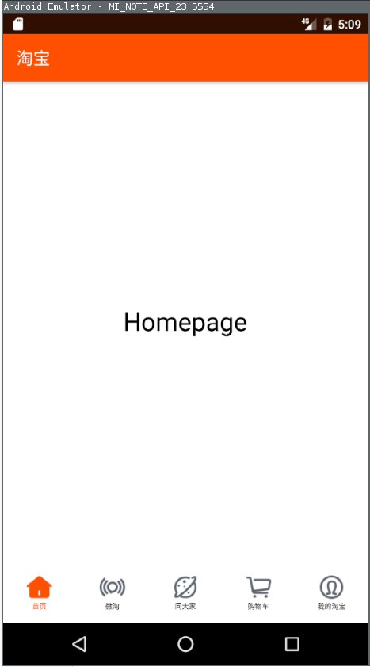

# Taobao Demo 开发环境配置

注意：本文档在 Android App 正式进入开发阶段以前会持续更新，请经常查看 git 日志以确保自己的开发环境符合最新的环境配置要求。

---

<!-- vscode-markdown-toc -->
* 1. [Android Studio](#AndroidStudio)
* 2. [SDK 与 AVD](#SDKAVD)

<!-- vscode-markdown-toc-config
	numbering=true
	autoSave=true
	/vscode-markdown-toc-config -->
<!-- /vscode-markdown-toc -->

---

##  1. Android Studio

下载安装：

[Android Studio 官方下载点](https://developer.android.com/index.html) 由于下载速度较慢，推荐使用 [Android Studio 郑州大学开源镜像站下载点](http://10.66.0.111/android/android-studio/2.2/)。文件名 `android-studio-ide-145.3276617-windows.exe`，407M。

##  2. SDK 与 AVD

SDK 配置方法：

1. 打开 Android Studio，依次点击 Tools > Android > SDK Manager > Launch Standalone SDK Manager。
1. 在打开的 `Android SDK Manager` 窗口里面修改 SDK 设置： [郑州大学 Android SDK 反代使用说明](http://10.66.0.111/wiki/android.html)。
1. 在打开的 `Adnroid SDK Manager` 窗口里面选择 [Android 开发必需的 packages](https://www.zhihu.com/question/31935836)，进行安装：
	- Tools::Android SDK Tools 安装最新
	- Tools::Adnroid SDK Platform-tools 安装最新
	- Android 6.0(API 23)::SDK Platform
	- Android 6.0(API 23)::Intel x86 Atom System Image
	- Extras::Android Support Repository

AVD 配置方法：

1. 打开 Adnroid Studio 后依次点击 Tools > Android > AVD Manager
1. 在打开的 `AVD Manager` 窗口中，点击左下角 Create Virtual Device > Import Hardware Profiles
1. 选择本文档库下的 `MI-NOTE.xml`，点击 OK 进行导入
1. 导入后，在 device definition 列表中选择『xiaomi MI NOTE LTE』 > Next > x86 Images > Marshmallow(API 23) > Next > Finish。

## Coding Style

将本『文档库』拉至本地后，在 Android Studio 中点击菜单栏 File > Import Settings，将 `coding_style.jar` 导入。`coding_style.jar` 仅包含 coding-style 的设置，其他配置需要自己在本地配置。
