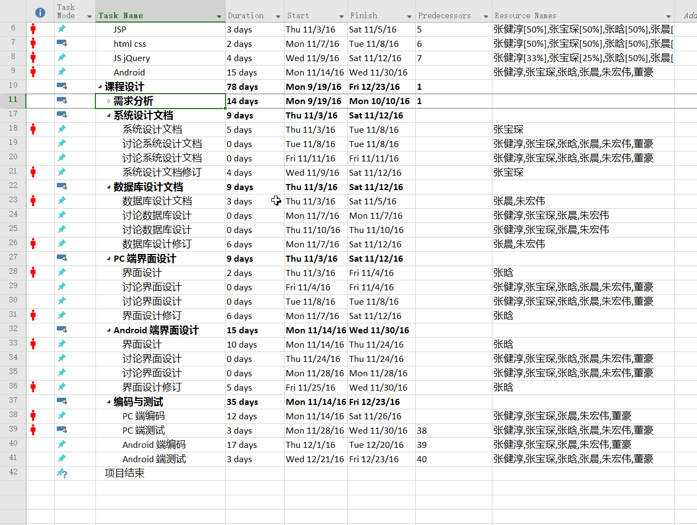
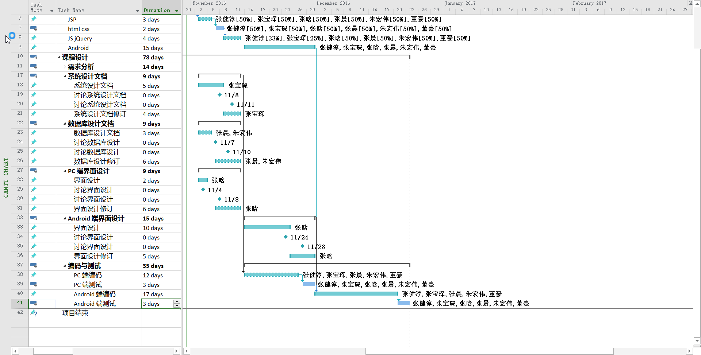

# 分阶段计划

本文档简要说明各个时间段内的任务分配。每个阶段截止前都需要把当前阶段的 Homework 发到我的邮箱，当然越早越好。邮箱地址： `rainstorm.me@outlook.com`

---

<!-- vscode-markdown-toc -->
* 1. [项目任务安排](#-0)
* 2. [09/05 - 09/18 MySQL](#MySQL-1)
* 3. [09/19 - 09/30 Markdown/Git](#MarkdownGit-2)
* 4. [10/10 - 10/19 JSP/servlet](#JSPservlet-3)
* 5. [10/20 - 10/26 HTML/CSS](#HTMLCSS-4)
* 6. [总体设计阶段任务分配](#-5)
* 7. [11/03 - 11/12 编码前任务安排](#-6)
	* 7.1. [学习任务安排](#-7)
	* 7.2. [系统分析与设计方面安排](#-8)

<!-- /vscode-markdown-toc -->

---

##  1. 项目任务安排

- 添加原因：

    1. 能使大家更好的把握项目的安排情况。
    1. 因为我的个人原因未能及时完成需求说明书，导致需求阶段向后拖延了近一周时间。把任务安排拿出来能更好地监督我们每个人的任务完成情况，特别是我自己。

- 任务安排图

    

    

##  2. 09/05 - 09/18 MySQL

-   学习目标：能够熟练的使用 SQL 语句进行数据库操作

-   学习资源：

    1.  [SQL教程](http://www.w3school.com.cn/sql/index.asp), 该教程中对比了不同数据库实现的差异，我们的重点是 MySQL。这个教程利用好了就足以达到学习目标。
    2. （选）『数据库系统概念 3-5 章』，该部分作为第一个SQL教程的参考材料。
    3. （选）[MySQL reference](http://dev.MySQL.com/doc/refman/5.7/en/). MySQL 的完整参考手册。

- 工具下载
    - [Download MySQL](http://dev.mysql.com/downloads/installer/)。 推荐完整安装包。

- 任务要求
    - [MySQL Homework](https://pan.baidu.com/s/1gf7Ghz1#path=%252FHomeworks%252FMySQL) 。

##  3. 09/19 - 09/30 Markdown/Git

- 学习目标：
    - 能够熟练使用 Markdown 语法进行文档编写
    - 能够熟练使用 Git 进行团队协作

- 学习资源：
    - Markdown.
        - [基本语法（Basic writing and formating syntax）](https://help.github.com/articles/basic-writing-and-formatting-syntax/)。
        - [表格（Organizing information with tables）](https://help.github.com/articles/organizing-information-with-tables/)。
        - [高亮代码块（Creating and highlighting code blocks）](https://help.github.com/articles/creating-and-highlighting-code-blocks/)。
        - （选）[Official Introduction](http://daringfireball.net/projects/markdown/) 。Markdown 语言的作者 John Gruber 对 Markdown 设计哲学以及语法的介绍。
        - （选）[Markdown 语法说明](http://wowubuntu.com/markdown/index.html) 。[Official Introduction](http://daringfireball.net/projects/markdown/) 的中文版。

    - Git.
        - [廖雪峰的 Git 入门教程](http://www.liaoxuefeng.com/wiki/0013739516305929606dd18361248578c67b8067c8c017b000)。质量较高！
        - （选）[Pro Git](https://git-scm.com/book/en/v2), 网站上有中文/英文版的，可以根据需要选择。

- 工具下载
    - [Download VS Code](https://code.visualstudio.com/Download) 。
    - [Download Git](https://git-scm.com/downloads) 。

- 任务要求
    - 使用 Markdown 语法，呈现出 [文档写作指南](https://github.com/c-rainstorm/OnlineShoppingSystem-Documents/blob/master/%E6%96%87%E6%A1%A3%E5%86%99%E4%BD%9C%E6%8C%87%E5%8D%97.md) 的效果。提示：写之前务必请先把该文档看一遍！
    - 使用 『廖雪峰的 Git 入门教程』来学习。我需要看到 GitHub 网站上的 `learngit` 仓库。
    - **作业提交方式：将你的 GitHub 用户名和 Markdown 作业以邮件方式发给我。**

##  4. 10/10 - 10/19 JSP/servlet

- 学习目标：对 JSP 有一个大致了解，重点内容如下：
    1.  了解 HTTP
    1.  独立编写过滤器；
    1.  掌握客户端请求及服务器响应的整个流程；
    1.  掌握 JSP 隐式对象；
    1.  掌握表单处理方法；
    1.  理解 session 的概念并掌握 session 属性操作；
    1.  掌握文件上传技术；
    1.  高级部分，掌握 EL 表达式

- 学习资源

    - [HTTP 详解](https://www.zybuluo.com/yangfch3/note/167490) 这个文章里的内容基本上都是一些概念性的东西，比较重要！而且这部分看完以后才能开始 JSP 学习！

    - [菜鸟教程（中文）](http://www.runoob.com/jsp/jsp-tutorial.html) 或 [tutorialsPoint（English）](http://www.tutorialspoint.com/jsp/index.htm)。两个教程任选其一。大致内容都是差不多的，有个别地方有差异，结合起来看应该是最好的。

    - Java Web 书籍
        - 需要看书的话可以去图书馆借，以我们课程设计的目标来说基本任何 Java Web 开发的书都能够满足需要。找的时候可以找出版社比较有名的来看。

- 任务要求
    - [Java 课件及作业](https://pan.baidu.com/s/1skLZIw9)，提取密码： pf8f。
    - 完成 JSP 部分作业。

##  5. 10/20 - 10/26 HTML/CSS

- 学习目标：掌握语法即可, (HTML5, CSS3 不作要求,有兴趣可以作为拓展内容，学了以后能做出更炫的页面)

- 学习资源：

    - [HTML 教程](http://www.w3school.com.cn/html/index.asp)。

    - [CSS 教程](http://www.w3school.com.cn/css/index.asp)，其中的盒模型是非常重要的概念，务必要掌握。

- 任务要求：

    - 自己动手写一个百度首页（未登陆状态）。

##  6. 总体设计阶段任务分配

- 数据库设计

    - 负责人： 张晨、朱宏伟。
    - 任务要求：
        1. 设计数据库的概念模型及物理模型。要求能够使用触发器等一系列特性帮助维护数据的一致性和完整性。
        1. 完成数据库设计文档。文档模板可以直接在网上找。
        1. 关于第九周的数据库演示报告， 完成 PPT 制作； 如果愿意上去讲的话可以上去讲，如果不想的话第九周周二（10/25）晚上之前将 PPT 发给张宝琛。
    - 时间限制： 10/17 - 10/30。

- 界面设计

    因为界面显示非常重要，并结合其他一些原因，所以目前决定张唅来负责总体设计期间的界面设计，及编码期间帮助其他人完成界面实现（要做好这一点需要过硬的前端水平），可以不参与后台的逻辑代码编写。
    - 负责人： 张唅。
    - 任务要求： 要求设计关于界面显示的所有内容。包括但不限于以下几点。
        1. 界面样式。
        1. 界面布局。
        1. 界面跳转关系。
        1. 界面交互。
        1. 数据显示。
    - 时间限制：
        1. 初步设计： 10/17 - 10/30。

- 总体设计 & 详细设计

    - 负责人： 张宝琛。
    - 任务要求： 完成设计文档。
    - 时间限制： 10/17 - 11/06。

##  7. 11/03 - 11/12 编码前任务安排

###  7.1. 学习任务安排

- 学习目标：
    
    因为之前的学习安排质量无法保证，所以在编码前我们统一进行重新学习。内容较多，时间比较紧，但我们要求也不是很高。只要掌握原理，知道是怎么回事就可以了。编码阶段把教程当做手册来查。目前这不足两周的时间要达到能够遇到问题知道查那部分能解决问题即可。

- 任务安排：

    - **11/03 - 11/30 Android**
    - 11/03 - 11/05 HTTP / JSP
    - 11/07 - 11/08 HTML / CSS
    - 11/09 - 11/12 JS / jQuery / Ajax / JSON
        - Ajax 和 JSON 内容较少。不会花费很长时间。
    

- 资源及重点内容
    
    - 以上内容我之前都写在 『项目总计划.md』，可以直接查看。

- 备注
    - 如果觉得当前时间安排的任务已经能够达到要求的话，可以转向其他内容的学习。
    - 为了很好的把握大家学习的情况，从 11 月 03 号开始，我每天晚上都会挨个询问当天的学习情况（根据重点内容提问。问题只涉及原理，开卷）。

###  7.2. 系统分析与设计方面安排

我简单介绍大概的安排。具体的可以直接查看新的任务安排图（在本文档最开始部分）：

- 张宝琛：
    - 系统分析文档

- 张晨、朱宏伟：
    - 数据库设计文档。

- 张晗：
    - PC 端及 Android 端界面设计

- 张健淳：
    - 文档初稿完成后，协助编写人员完成文档修订。

- 董豪：
    - 学习调试 / 测试工具的使用，编码前帮助其他人快速熟悉相关工具。