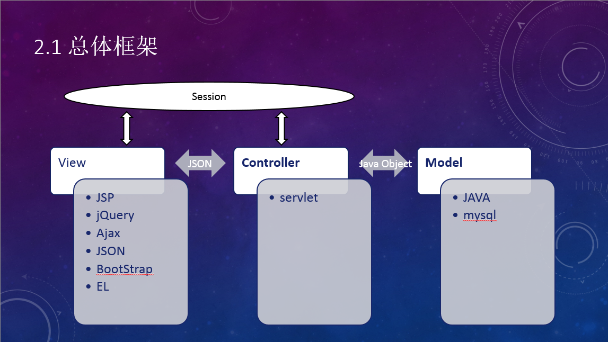

# 项目学习计划

本文确定了项目目标，使用技术，并提供一些学习资源。

---

<!-- vscode-markdown-toc -->
* 1. [项目总体目标](#-0)
* 2. [选用技术— Java Web](#JavaWeb-1)
	* 2.1. [为什么使用 Java Web 技术](#JavaWeb-2)
	* 2.2. [技术的总体框架](#-3)
* 3. [学习内容及相应资源](#-4)
	* 3.1. [MySQL](#MySQL-5)
	* 3.2. [Markdown/Git](#MarkdownGit-6)
	* 3.3. [JSP/servlet](#JSPservlet-7)
	* 3.4. [HTML/CSS](#HTMLCSS-8)
	* 3.5. [JavaScript/jQuery/AJAX/JSON](#JavaScriptjQueryAJAXJSON-9)
	* 3.6. [Bootstrap（暂定）](#Bootstrap-10)

<!-- /vscode-markdown-toc -->

---

##  1. 项目总体目标

1.  建立工程意识，提高设计及编码能力；

2.  学习一些新技术；

3.  提高我们解决问题的能力；

4.  希望我们到学期结束的时候每个人都能独立的进行Java Web项目开发

5.  顺便把课程设计拿到 90+。

##  2. 选用技术— Java Web

###  2.1. 为什么使用 Java Web 技术

1.  Java Web 本来是学校作为选修课《面向对象技术》来教授的，但是由于各方面原因，我们这届没有开这门课程。
2.  Java Web 技术基于 B/S 模式。浏览器界面不仅直观和易于使用，更主要的是基于浏览器平台的任何应用软件其风格都是一样的，使用人对操作培训的要求不高，而且软件可操作性强。
3.  我曾经学习过 Java Web，并使用该技术完成了一个小型的订餐系统。所以对 Java Web 有一个大致了解，相对来说对项目的把控会好一些。

###  2.2. 技术的总体框架

这张图偏是我之前提到的网上定餐系统的技术框架图。

系统使用 MVC 的软件体系结构，

1.  View 层。用来将数据库中的数据渲染到前台，这部分是用户可以直接通过浏览器操作的部分。使用的技术大概就是图上的那几种。

    -   JSP 用来动态生成页面，可以直接把它当做增强版的 HTML 文件，只是在 HTML 基础上包含了一些隐式对象等，需要一定 HTML 基础和 HTTP 基础；

    -   jQuery 是 JavaScript 库，使用起来比 JavaScript 更加方便， 需要 JavaScript 基础；

    -   AJAX 技术用来对网页内容进行局部更新（不需要刷新页面）；

    -   JSON 是一种被广泛使用的数据传输格式，在该系统中，view &lt;–--&gt; controller 之间数据传输，以及 view &lt;–--&gt; session &lt;–--&gt; controller 之间部分数据传输都是使用的 JSON 格式

    -   Bootstrap 是一个目前比较流行的前端框架，使用该框架可以快速搭建优雅的前端界面，需要 HTML, CSS, JavaScript知识作为基础。界面是由我们自己写,还是直接使用网上的模板的问题我们以后再讨论，不过就算使用模板，也需要我们掌握 Bootstrap，因为我们找的那些模板也并不一定都符合我们的要求，所以需要我们对 Bootstrap 有一个大致了解，以便于我们对模板的修改。

1.  Controller 层。用来控制后台模型的选用，已及向前台发送数据。

    -   Servlet 作为控制层载体。需要 HTTP 基础

2.  Model 层。用来对数据库进行操作。

    -   MySQL 。数据库使用 MySQL

    -   JDBC

##  3. 学习内容及相应资源

###  3.1. MySQL

-   学习目标：能够熟练的使用 SQL 语句进行数据库操作

-   学习资源：

    1.  [SQL教程](http://www.w3school.com.cn/sql/index.asp), 该教程中对比了不同数据库实现的差异，我们的重点是MySQL。这个教程利用好了就足以达到学习目标。

    2.  (选)『数据库系统概念 3-5 章』，该部分作为第一个SQL教程的参考材料。

    3.  (选)[MySQL reference](http://dev.MySQL.com/doc/refman/5.7/en/). MySQL 的完整参考手册。

###  3.2. Markdown/Git

- 学习目标：
    - 能够熟练使用 Markdown 语法进行文档编写
    - 能够熟练使用 Git 进行团队协作

- 学习资源：
    - Markdown 参考资料见『文档写作指南.md』
    - [Git 教程](http://www.liaoxuefeng.com/wiki/0013739516305929606dd18361248578c67b8067c8c017b000)。 廖雪峰的 Git 入门教程，质量较高！如果有兴趣深入学习的话可以看 [Pro Git](https://git-scm.com/book/en/v2), 网站上有中文/英文版的，可以根据需要选择。

###  3.3. JSP/servlet

-   学习目标：对 JSP 有一个大致了解，重点内容如下：

    1.  了解 HTTP

    2.  独立编写过滤器；

    3.  掌握客户端请求及服务器响应的整个流程；

    4.  掌握 JSP 隐式对象；

    5.  掌握表单处理方法；

    6.  理解 session 的概念并掌握 session 属性操作；

    7.  掌握文件上传技术；

    8.  高级部分，掌握 EL 表达式

-   学习资源

    -   [HTTP 详解](http://www.cnblogs.com/TankXiao/archive/2012/02/13/2342672.html)这个文章里的内容基本上都是一些概念性的东西，比较重要！而且这部分看完以后才能开始 JSP 学习！

    -   [菜鸟教程（中文）](http://www.runoob.com/jsp/jsp-tutorial.html) 或 [tutorialsPoint（English）](http://www.tutorialspoint.com/jsp/index.htm)。两个教程任选其一。大致内容都是差不多的，有个别地方有差异，结合起来看应该是最好的。

###  3.4. HTML/CSS

-   学习目标：掌握语法即可, (HTML5, CSS3 不作要求,有兴趣可以作为拓展内容，学了以后能做出更炫的页面)

-   学习资源：

    -   [HTML 教程](http://www.w3school.com.cn/html/index.asp)

    -   [CSS 教程](http://www.w3school.com.cn/css/index.asp) 其中的盒模型是非常重要的概念，务必要掌握。

###  3.5. JavaScript/jQuery/AJAX/JSON

-   学习目标：

    -   熟练掌握 HTML DOM 操作

    -   掌握 JavaScript 的几个对象

    -   熟练掌握 jQuery 的选择器（项目中使用频繁）

    -   熟练掌握 jQuery 文档操作（项目中使用频繁）

    -   数量掌握 jQuery 的 AJAX $.get() 和 $.post （项目中使用频繁）

    -   掌握 JSON 语法

-   学习资源

    -   [JavaScript 教程](http://www.w3school.com.cn/js/index.asp)

    -   [AJAX 教程](http://www.w3school.com.cn/ajax/ajax_intro.asp)

    -   [JSON 教程](http://www.w3school.com.cn/json/index.asp)

    -   [jQuery 教程](http://www.w3school.com.cn/jQuery/index.asp)

###  3.6. Bootstrap（暂定）

-   学习目标：能够熟练使用框架搭建前端界面

-   学习资源：[菜鸟教程](http://www.runoob.com/bootstrap/bootstrap-tutorial.html)
