# 总体设计文档

<!-- vscode-markdown-toc -->
* 1. [时序图](#)
	* 1.1. [游客](#-1)
		* 1.1.1. [购物车管理](#-1)
	* 1.2. [用户功能](#-1)
		* 1.2.1. [登录/注册](#-1)
		* 1.2.2. [获取商品信息](#-1)
		* 1.2.3. [购物车管理](#-1)
		* 1.2.4. [收货人管理](#-1)
		* 1.2.5. [订单管理](#-1)
		* 1.2.6. [收藏管理](#-1)
		* 1.2.7. [申请开店/用户投诉](#-1)
	* 1.3. [商家功能](#-1)
		* 1.3.1. [店铺信息管理](#-1)
		* 1.3.2. [订单管理](#-1)
		* 1.3.3. [商品管理](#-1)
		* 1.3.4. [销售统计](#-1)
	* 1.4. [管理员功能](#-1)
		* 1.4.1. [登录](#-1)
		* 1.4.2. [事务处理](#-1)
		* 1.4.3. [用户信息管理](#-1)
		* 1.4.4. [店铺信息管理](#-1)

<!-- /vscode-markdown-toc -->

---

##  1. 时序图

###  1.1. 游客

####  1.1.1. 购物车管理

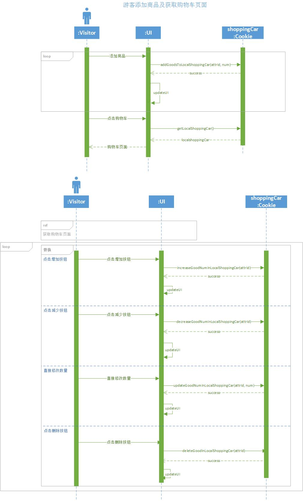

###  1.2. 用户功能

####  1.2.1. 登录/注册

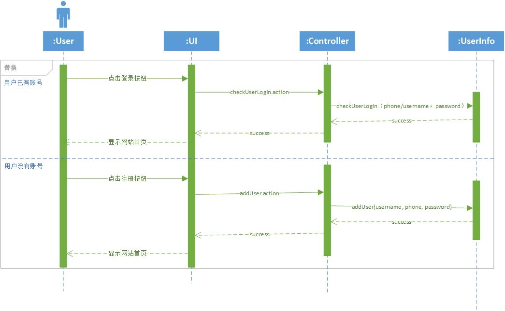

####  1.2.2. 获取商品信息

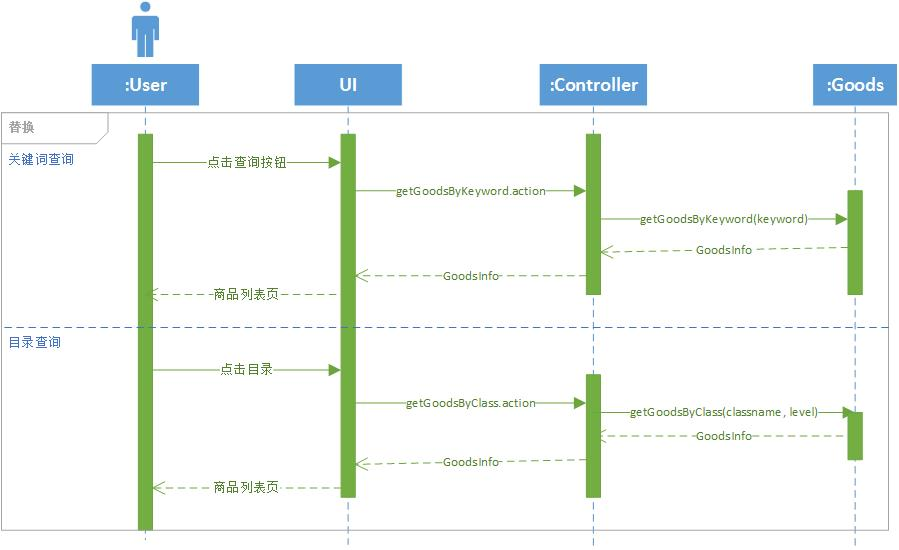

####  1.2.3. 购物车管理

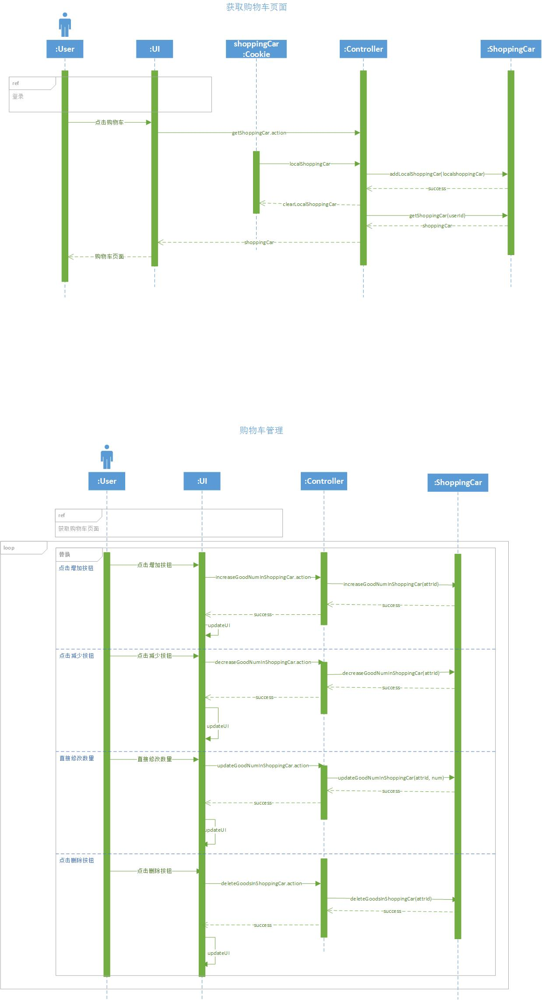

####  1.2.4. 收货人管理

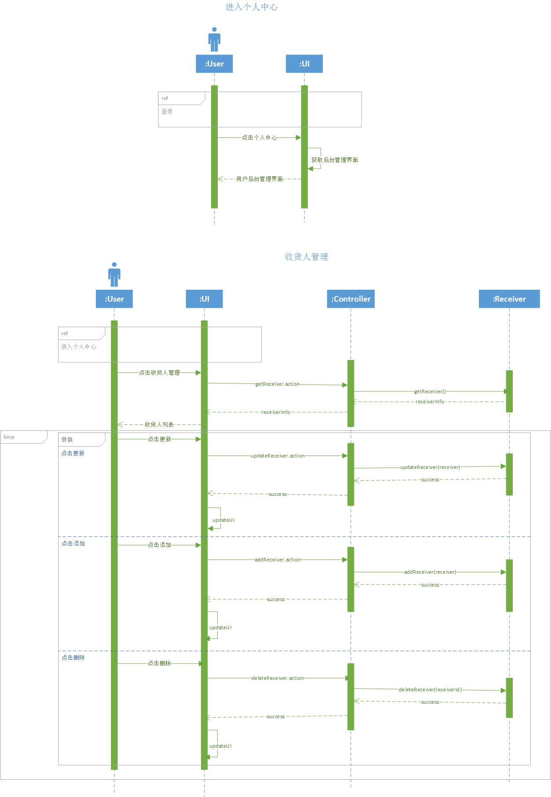

####  1.2.5. 订单管理

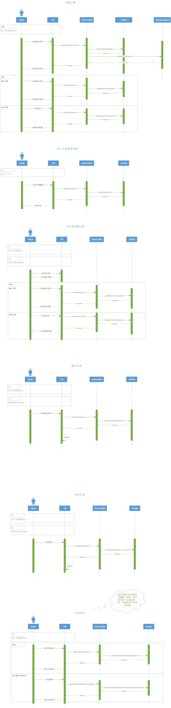

####  1.2.6. 收藏管理

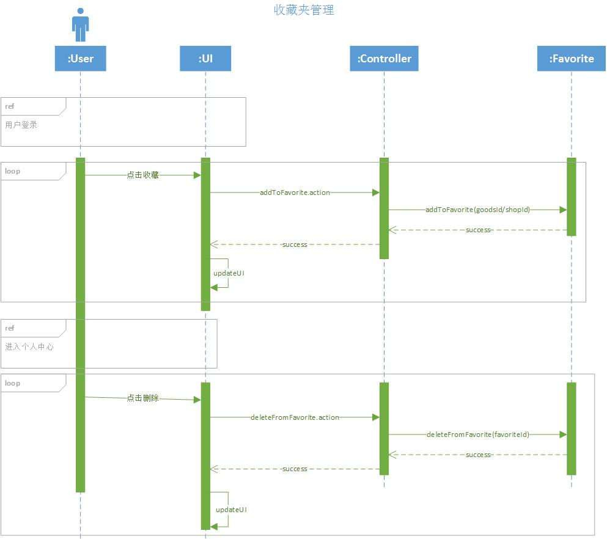

####  1.2.7. 申请开店/用户投诉

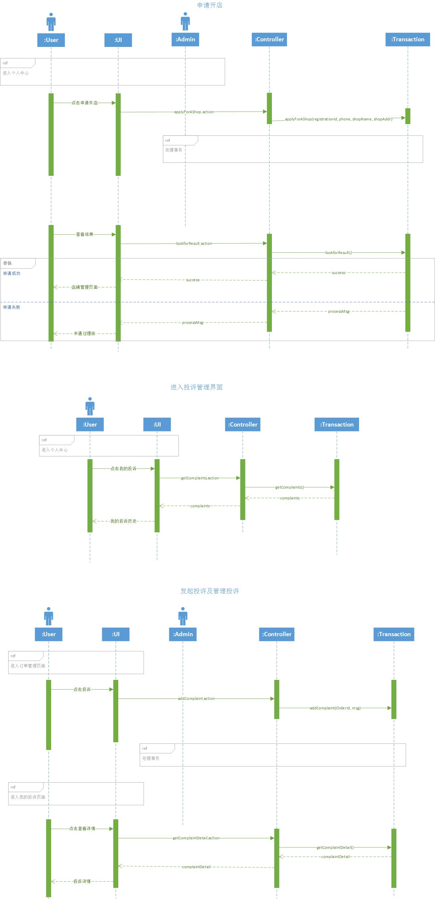

###  1.3. 商家功能

####  1.3.1. 店铺信息管理

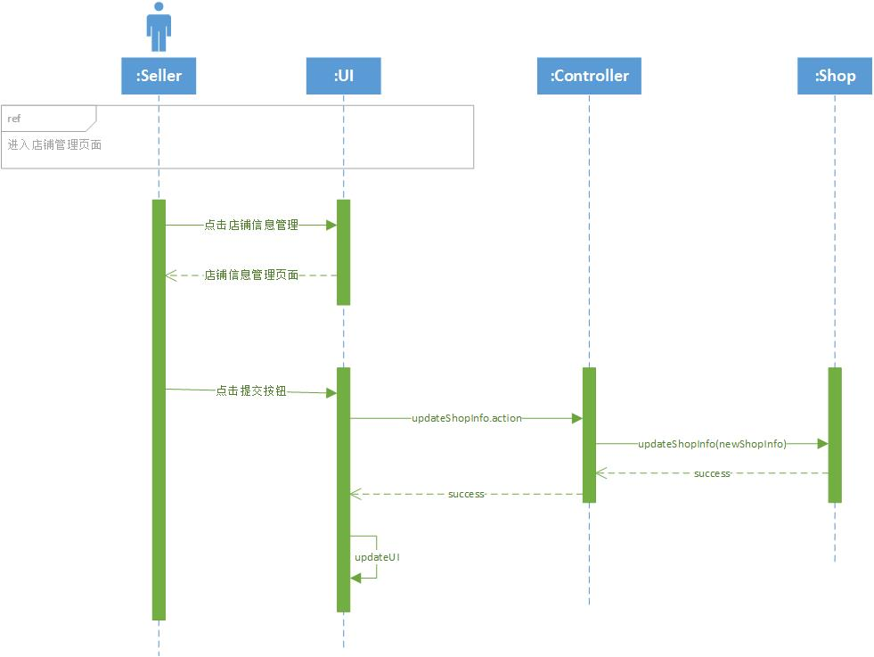

####  1.3.2. 订单管理

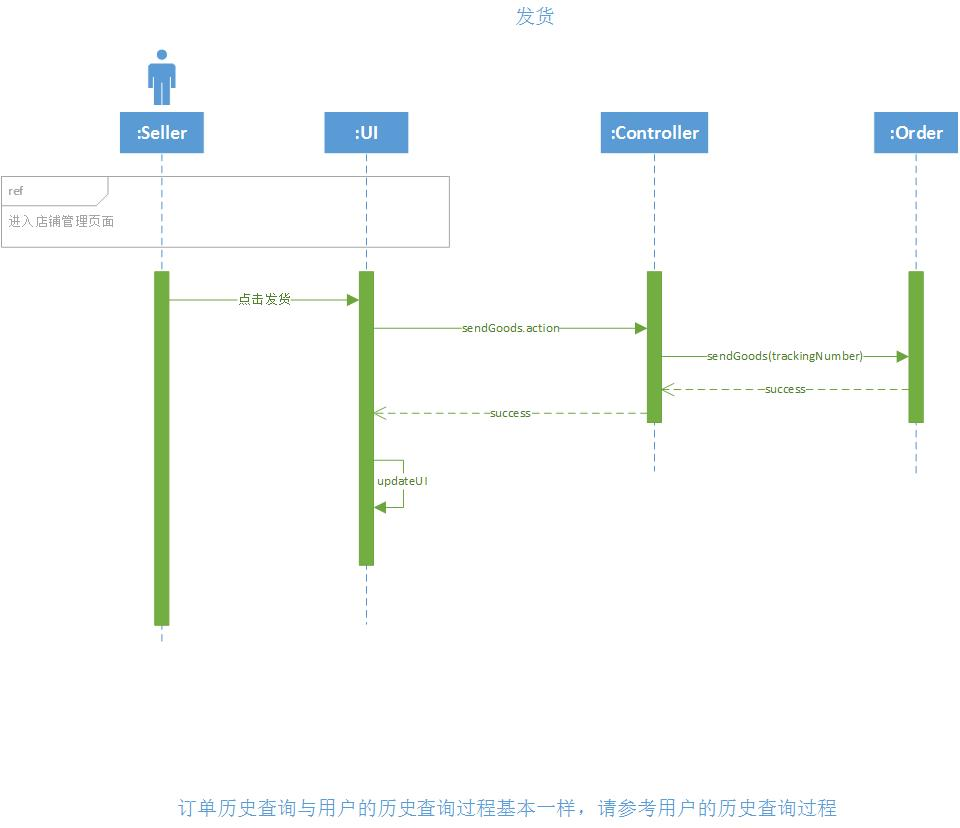

####  1.3.3. 商品管理

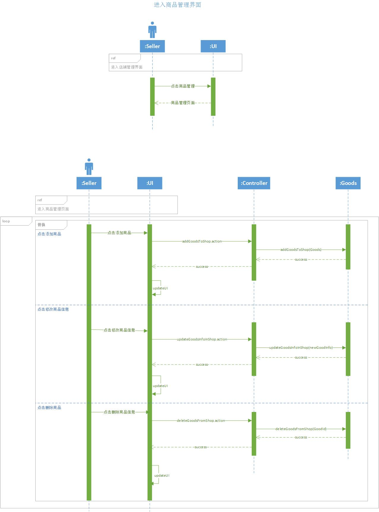

####  1.3.4. 销售统计

- [JavaScript plotting library for jQuery](http://www.flotcharts.org/)
- 根据绘图需要，从数据库获取相应数据。

###  1.4. 管理员功能

####  1.4.1. 登录

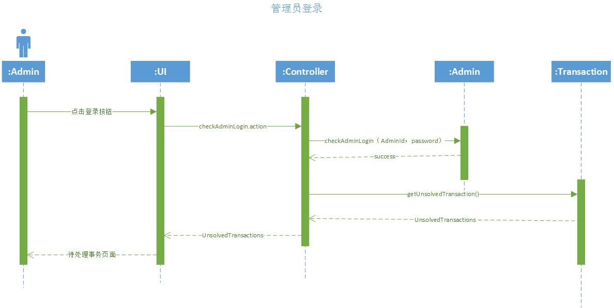

####  1.4.2. 事务处理

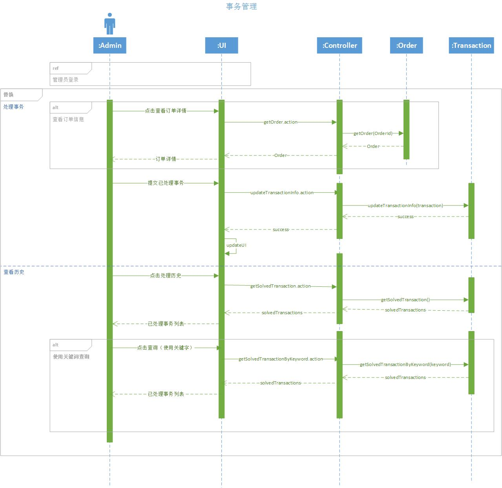

####  1.4.3. 用户信息管理

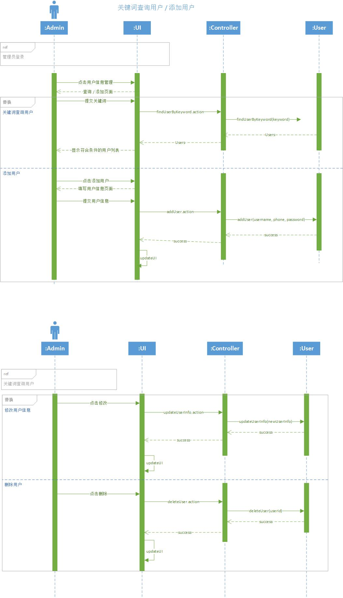

####  1.4.4. 店铺信息管理

与用户信息管理类似，不再提供时序图
