# 网上购物系统软件需求规格说明书

<!-- vscode-markdown-toc -->
* 1. [关于此项目](#-0)
	* 1.1. [项目提出者与开发人员](#-1)
	* 1.2. [开发周期](#-2)
	* 1.3. [用户特点](#-3)
* 2. [关于此文档](#-4)
	* 2.1. [主要读者](#-5)
	* 2.2. [术语和缩略语](#-6)
* 3. [用户分类](#-7)
* 4. [用户功能需求](#-8)
	* 4.1. [总功能表与用例图](#-9)
	* 4.2. [数据字典](#-10)
	* 4.3. [游客 / 用户](#-11)
		* 4.3.1. [游客 / 用户商品查询与浏览](#-12)
		* 4.3.2. [游客 / 用户购物车管理](#-13)
		* 4.3.3. [游客 / 用户登陆与注册](#-14)
		* 4.3.4. [用户个人信息管理](#-15)
		* 4.3.5. [用户收货人管理](#-16)
		* 4.3.6. [用户收藏夹管理](#-17)
		* 4.3.7. [用户投诉商家与开店申请](#-18)
		* 4.3.8. [用户发起订单](#-19)
		* 4.3.9. [用户管理订单](#-20)
	* 4.4. [商家](#-21)
		* 4.4.1. [订单管理](#-22)
		* 4.4.2. [店铺信息管理](#-23)
		* 4.4.3. [商品管理](#-24)
		* 4.4.4. [销售统计](#-25)
	* 4.5. [管理员](#-26)
		* 4.5.1. [登录](#-27)
		* 4.5.2. [对用户信息管理](#-28)
		* 4.5.3. [处理投诉 / 申请](#-29)
		* 4.5.4. [查询订单](#-30)
		* 4.5.5. [对店铺信息管理](#-31)
	* 4.6. [投诉 / 申请状态转换图](#-32)
	* 4.7. [订单状态转换与可见性](#-33)
* 5. [用户非功能需求](#-34)
	* 5.1. [性能要求](#-35)
	* 5.2. [输入输出要求](#-36)
	* 5.3. [故障处理要求](#-37)

<!-- /vscode-markdown-toc -->

---

##  1. 关于此项目

###  1.1. 项目提出者与开发人员

| | |
| --- | --- |
| 项目提出者 | 宋玉、赵东明老师 |
| 开发人员 | 郑州大学软件工程专业 2014 级第九小组全体成员 |
| 所开发系统 | B/S 模式网上购物系统 |

###  1.2. 开发周期

本项目的开发周期为 2016 - 2017 学年第一学期。项目启动时间为 2016 年 9 月 5 日，预期完成时间为 2016 年 12 月 23 日。

###  1.3. 用户特点

系统假定用户会使用电脑，并能够浏览网页内容。

##  2. 关于此文档

本文档主要用于说明用户提出的需求，明确系统的功能，以及相关的约束和要求，为开发人员提供开发依据。

###  2.1. 主要读者

主要读者是参与需求分析、项目设计、项目实现和测试的相关人员。

###  2.2. 术语和缩略语

| 术语、缩略语 | 解释 |
| :--- | :--- |
| 用户 | 买家、卖家统称为用户 |
| 普通用户 | 用户的买家部分 |
| 商家 | 用户的卖家部分 |
| 管理员 | 系统管理员，主要负责用户信息管理及店铺审核 |

##  3. 用户分类

系统的用户有游客、用户、管理员三类。其中用户可分为普通用户和商家两种。

不同的用户角色具有不同的需求和权限，并在需要时可以进行角色转换。

- 用户可以使用游客角色。
- 管理员可以使用游客角色。
- 商家可以使用普通用户角色。

##  4. 用户功能需求

###  4.1. 总功能表与用例图

系统需实现以下功能：

||表 3: 功能概述|
|:---|:---|
|**功能名称**|**功能概诉**|
|商品查询与浏览|游客 / 用户对商品目录检索、关键词检索|
|购物车管理|用户对购物车内商品的添加、删除、更新|
|登陆与注册|游客注册；用户 / 管理员登陆，登录后用户只能查看到自己能使用的功能|
|用户信息管理|用户 / 管理员对用户信息的添加、删除、更新、查询|
|投诉商家|用户以已完成订单为依据对商家进行投诉；管理员处理投诉|
|收货人管理|收货人的添加、删除、更新、查询|
|收藏夹管理|用户对已收藏店铺 / 商品的添加、删除、查询|
|订单发起与管理|订单的发起、发货、确认收货、历史查询|
|开店申请|用户发起开店申请，管理员处理申请|
|店铺信息管理|商家 / 管理员对店铺信息的添加、删除、更新、查询|
|商品管理|商家对商品的添加、删除、更新、状态查看|
|销售统计|店铺内整体 / 单品销量和利润趋势 / 分布的统计|

为了保持用例图的简单，下面的用例图省去了登录与注册，也没有表现出合适的用户权限。

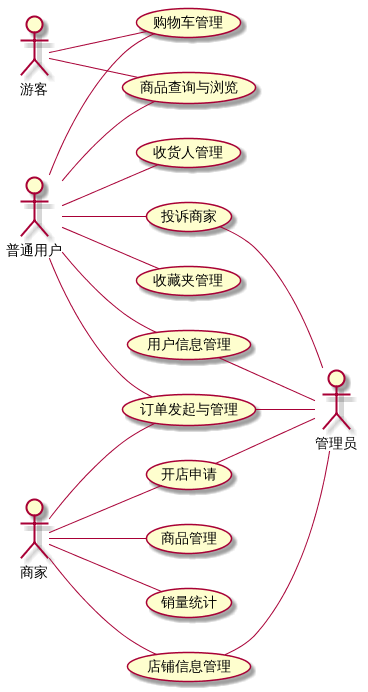

###  4.2. 数据字典

数据字典描述要和系统交互的数据。

数据字典已移入数据库设计文档中。

###  4.3. 游客 / 用户

####  4.3.1. 游客 / 用户商品查询与浏览

系统要支持目录和关键词两种方式搜索。

游客 / 用户搜索用例活动图如下：

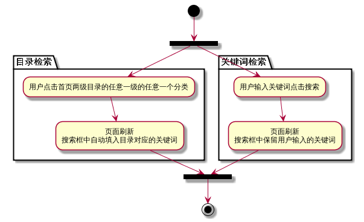

####  4.3.2. 游客 / 用户购物车管理

游客 / 用户可以通过商品页面直接填加商品到购物车。在管理购物车时，可以修改商品数量，也可以直接删除商品。游客  / 用户购物车在关闭浏览器或者退出登录后仍保留。

游客 / 用户购物车管理用例活动图如下：

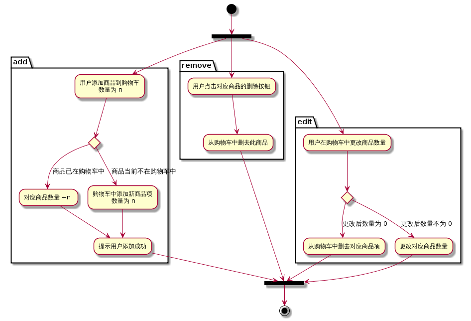

####  4.3.3. 游客 / 用户登陆与注册

游客可以通过注册来获取账户，注册时要提供自定义的用户名和可用的手机号，用户密码要满足特定的要求，具体见数据字典。

游客 / 用户登录与注册用例活动图如下：

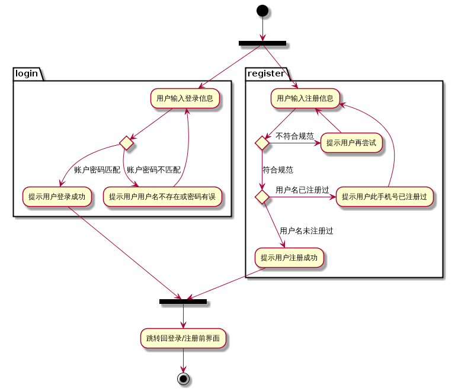

####  4.3.4. 用户个人信息管理

用户可以修改自己除用户名以外的任何个人信息，但不允许自主删除帐号。

用户个人信息管理过程过于简单，不提供用例活动图。

####  4.3.5. 用户收货人管理

系统要记录用户收货地址使用次数，当用户管理或挑选地址使用时将使用次数最多的地址排在首位。当用户自主删除收货人时，系统要保留数据，以备后用。

用户搜索用例活动图如下：

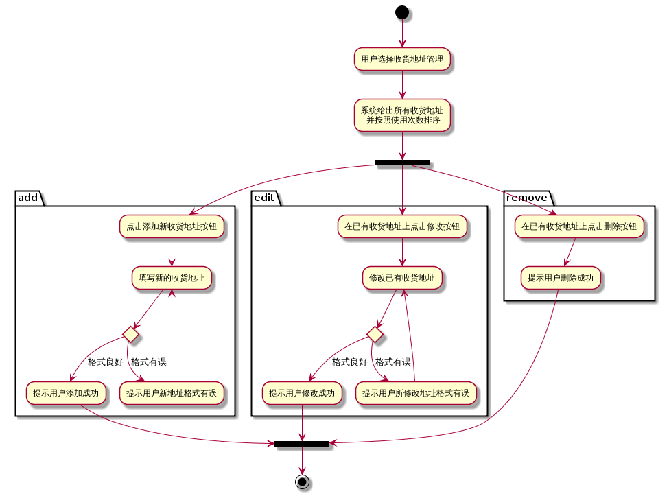

####  4.3.6. 用户收藏夹管理

用户可以直接在商品页面点击收藏按钮收藏商品，在店铺页面点击收藏按钮收藏店铺。在管理收藏夹时，可以将任意的店铺和商品从收藏夹中删除。用户自主删除收藏后，系统要保留数据，以备后用。

用户收藏夹管理用例活动图如下：

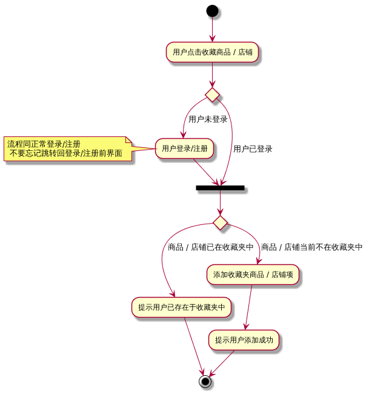

####  4.3.7. 用户投诉商家与开店申请

用户若对商家或订单有所不满，所可以以已有订单作为投诉依据。在发起投诉时，系统要提示用户先与商家沟通，减少系统中总投诉的数量。投诉由管理员处理。

用户若想通过此系统销售物品，可以通过发起开店申请。开店申请由管理员处理。

用户投诉商家用例活动图如下：

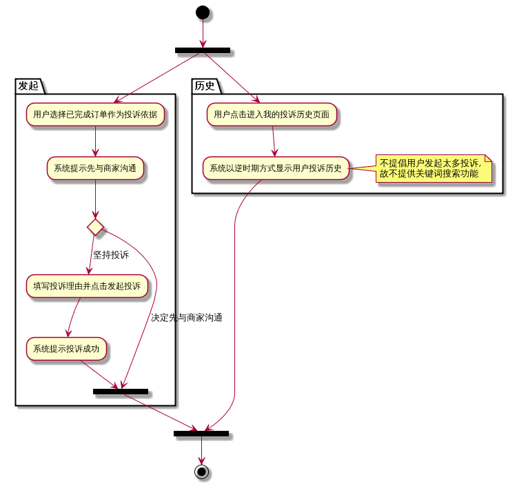

商家（其实是用户）发起开店申请用例活动图如下：

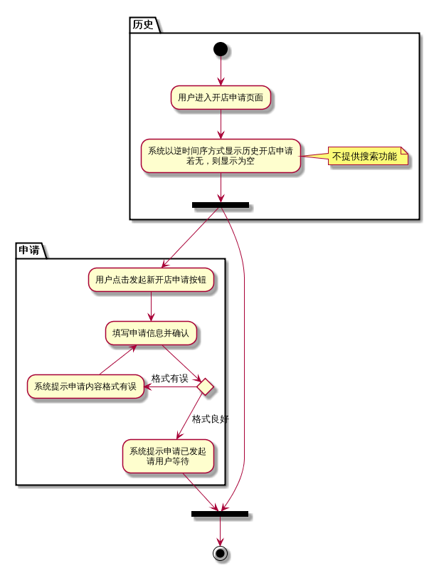

####  4.3.8. 用户发起订单

用户通过在购物车中挑选商品发起订单。

用户发起订单用例活动图如下：

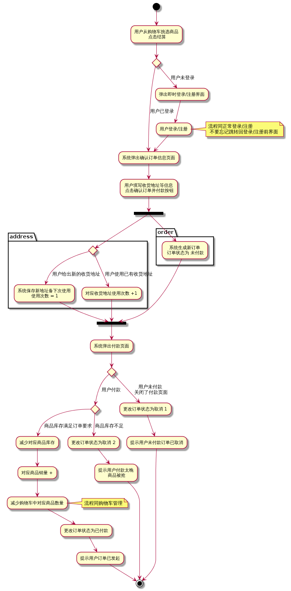

####  4.3.9. 用户管理订单

用户在订单管理中心能看到自己所有状态的所有订单，但只能查看详细信息或对订单确认收货，不能删除订单。订单管理中心要提供用户按时间和按关键词两种查询方式。当用户确认收货时，不管当前订单状态是什么，标识着一个订单的结束。订单完成或后用户可以立即或稍后对商品进行评价，评价将影响店铺评价等级。

用户管理订单用例活动图如下：

###  4.4. 商家

####  4.4.1. 订单管理

商家可见的订单状态有限，具体描述如如『订单状态转换与可见性』一节描述。商家可以查看订单详细信息和对订单进行发货，且支持批量发货操作。管理中心要提供按时间范围查询和按关键词查询两种方式。

商家管理订单用例活动图如下：

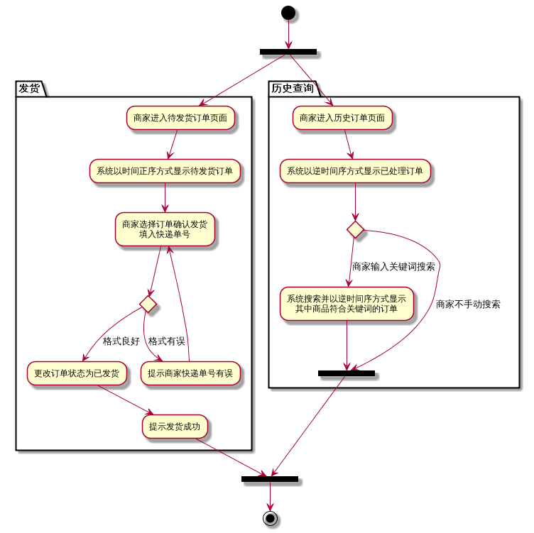

####  4.4.2. 店铺信息管理

商家可以修改自己店铺信息，不允许自主删除店铺。

商家店铺信息管理用例活动图如下：

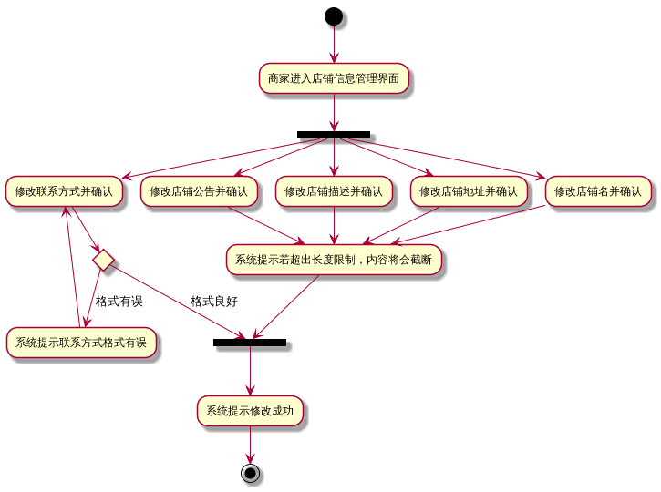

####  4.4.3. 商品管理

商家可以对自己店铺内的商品进行添加、修改、删除。商家可以对指定产品进行定时打折，可以指定打折后的金额或打折的比例。当商家 / 管理员删除商品时，系统要保留数据，以备后用。

商家商品管理用例活动图如下：

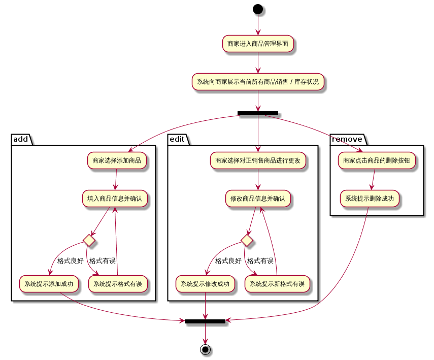

####  4.4.4. 销售统计

销售统计要产生报表，包括对店铺内整体、单个商品销售情况统计：

1. 整体销售统计：
	- 商品利润分布（饼图）。
	- 商品销量分布（饼图）。
	- 总销量趋势（折线图）。
	- 总利润趋势（折线图）。
1. 单个商品销售统计：
	- 销量趋势（折线图）。
	- 利润趋势（折线图）。

商家获得销售统计用例活动图如下：

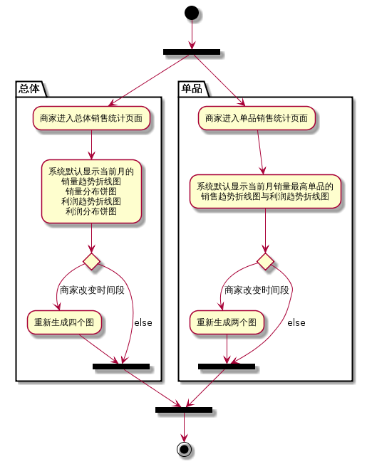

###  4.5. 管理员

管理员不能自主注册，只能通过给定的帐号进行登录。

####  4.5.1. 登录

管理员登录时候供编号和密码。

登录过程过于简单，不提供用例活动图：）

####  4.5.2. 对用户信息管理

管理员可以通过用户手机号或用户名或昵称来定位用户。管理员可以添加系统用户、修改任何用户的个人信息，也可以删除任何用户。当管理员删除用户时，系统要保留数据，以备后用。

管理员对用户信息管理用例活动图如下：

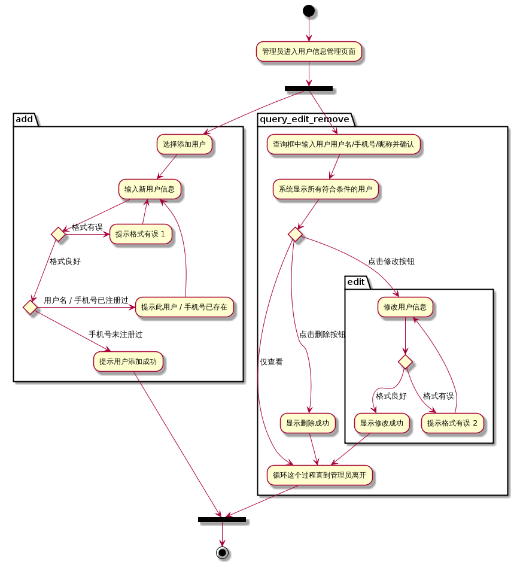

####  4.5.3. 处理投诉 / 申请

管理员在处理投诉 / 申请时，要能直接点击订单号获取订单详细信息。

管理员处理投诉与开店申请用例活动图如下：

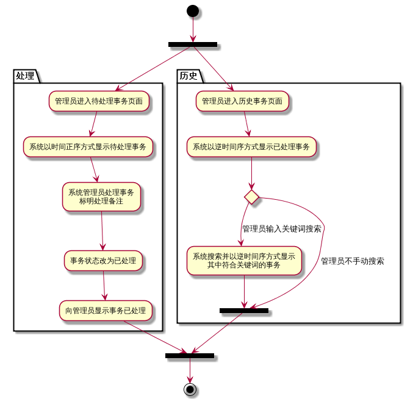

####  4.5.4. 查询订单

所有订单的所有状态对管理员可见。管理员可以通过订单号查询订单、查看订单详细信息，但不可操作订单状态。

查询订单过程过于简单，不提供用例活动图。

####  4.5.5. 对店铺信息管理

管理员可以修改任何店铺信息，可以删除任何店铺。当管理员删除店铺时，系统要保留数据，以备后用。

管理员对店铺信息管理用例活动图如下：

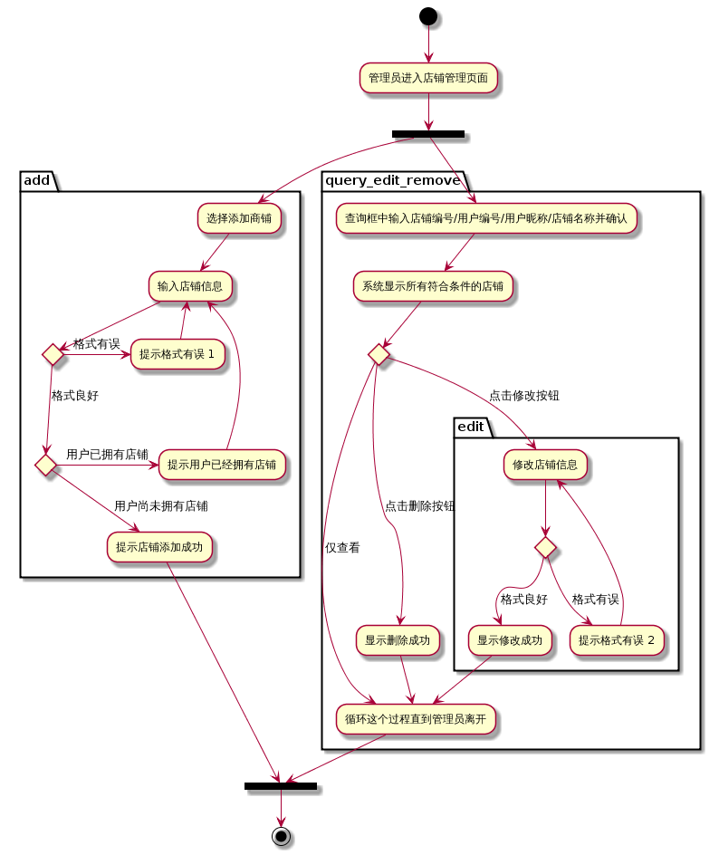

###  4.6. 投诉 / 申请状态转换图

投诉 / 申请由用户发起，由管理员处理 / 拒绝。

投诉 / 申请事务的状态转换图如下：

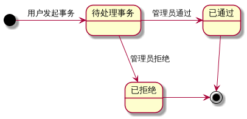

###  4.7. 订单状态转换与可见性

用户行为与订单状态转换图如下：

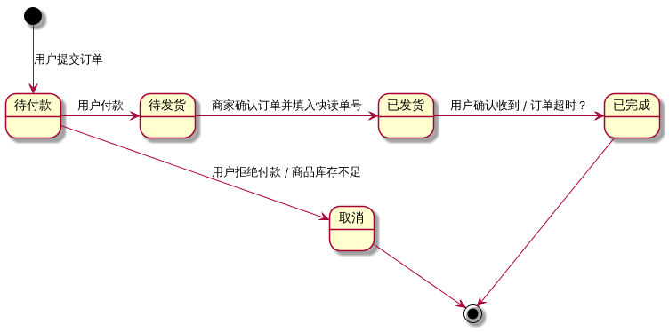

用户与商家订单可见性如下：

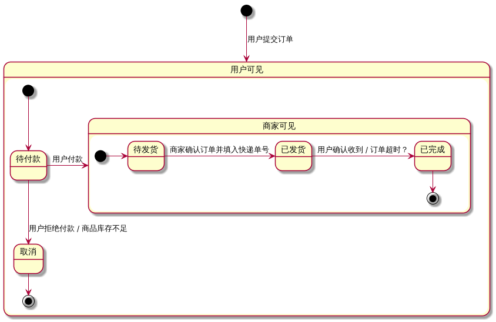

##  5. 用户非功能需求

###  5.1. 性能要求

系统响应时间在可接受范围内。

###  5.2. 输入输出要求

- 所有用户要求有良好的操作界面。
- 商家和管理员要求良好的报表生成。

###  5.3. 故障处理要求

应能够提供相应的故障处理能力，保证系统正常运行。
