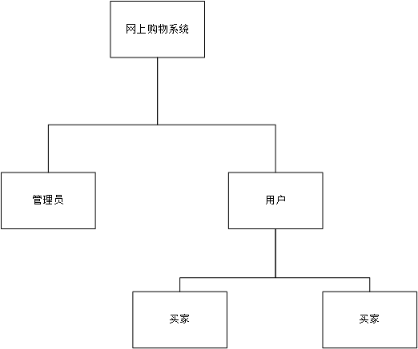
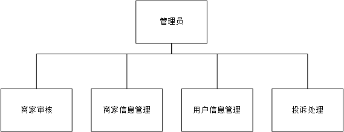
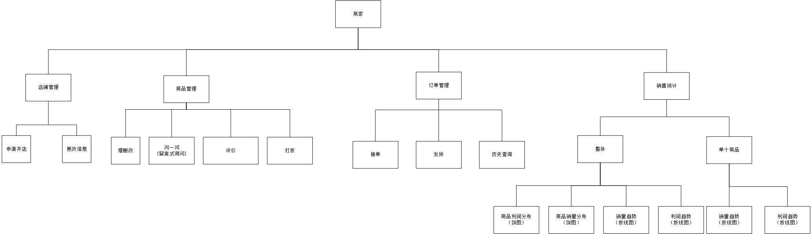
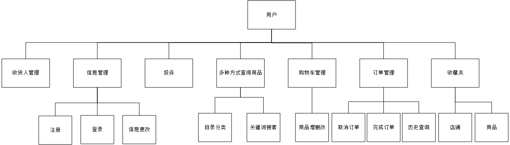

# 网上购物系统软件需求规格说明书

<!-- vscode-markdown-toc -->
* 1. [关于此项目](#-0)
	* 1.1. [项目提出者与开发人员](#-1)
	* 1.2. [开发周期](#-2)
	* 1.3. [用户特点](#-3)
* 2. [关于此文档](#-4)
	* 2.1. [主要读者](#-5)
	* 2.2. [术语和缩略语](#-6)
* 3. [需求规定](#-7)
	* 3.1. [对功能的要求](#-8)
		* 3.1.1. [系统架构](#-9)
		* 3.1.2. [系统用户](#-10)
		* 3.1.3. [系统功能模块分析](#-11)
	* 3.2. [对性能的要求](#-12)
	* 3.3. [对输入输出的要求](#-13)
	* 3.4. [故障处理要求](#-14)
* 4. [附录](#-15)
	* 4.1. [表3-用户信息表](#3--16)
	* 4.2. [表4-收货人信息表](#4--17)
	* 4.3. [表5-订单信息表](#5--18)
	* 4.4. [表6-商品信息表](#6--19)
	* 4.5. [表7-店铺信息表](#7--20)

<!-- /vscode-markdown-toc -->

---
##  1. 关于此项目

###  1.1. 项目提出者与开发人员

| | |
| --- | --- |
| 项目提出者 | 宋玉、赵东明老师 |
| 开发人员 | 郑州大学软件工程专业 2014 级第九小组全体成员 |
| 所开发系统 | B/S 模式网上购物系统 |

###  1.2. 开发周期

本项目的开发周期为 2016 - 2017 学年第一学期。项目启动时间为 2016 年 9 月 5 日，预期完成时间为 2016 年 12 月 23 日。

###  1.3. 用户特点

系统假定用户会使用电脑，并能够浏览网页内容。

##  2. 关于此文档

本文档主要用于说明用户提出的需求，明确系统的功能，以及相关的约束和要求，为开发人员提供开发依据。

###  2.1. 主要读者

主要读者是参与需求分析、项目设计、项目实现和测试的相关人员。

###  2.2. 术语和缩略语

| 术语、缩略语 | 解释 |
| :--- | :--- |
| 用户 | 买家、卖家统称为用户 |
| 普通用户 | 用户的买家部分 |
| 商家 | 用户的卖家部分 |
| 管理员 | 系统管理员，主要负责用户信息管理及店铺审核 |

##  3. 需求规定

###  3.1. 对功能的要求

####  3.1.1. 系统架构

1. 总体架构

	

1. 管理员功能架构

	

1. 商家功能架构

	

1. 用户功能架构

	

####  3.1.2. 系统用户

网上购物系统是一个基于 B/S 模式的网上购物平台。系统的主要用户有游客、用户、管理员。其中用户分为两部分功能，一是普通用户，一是商家。不同的用户角色具有不同的权限和功能。

游客不需要登陆系统，只能进行商品查询，浏览商品信息；普通用户可以进行订单管理、收货人管理、个人信息管理等；商家可以进行商品管理、订单管理、店铺信息管理等；管理员可以进行用户信息管理、店铺信息管理、处理开店申请、处理用户投诉等。

用户的具体描述如下表所示：

||表1 用户描述|
|:---|:---|
|游客|游客不需要登陆系统，只能进行商品查询，浏览商品信息，购物车管理；|
|普通用户|普通用户在本系统有如下功能：<ol><li>商品查询</li><li>个人信息管理</li><li>收货人管理</li><li>购物车管理</li><li>订单管理</li><li>收藏夹管理</li><li>投诉商家</li></ol>|
|商家|商家在本系统有如下功能：<ol><li>店铺信息管理</li><li>商品管理</li><li>订单管理</li><li>销售统计</li></ol>|
|管理员|管理员在本系统有如下功能：<ol><li>用户信息管理</li><li>店铺信息管理</li><li>处理用户投诉</li><li>处理开店申请</li></ol>|

####  3.1.3. 系统功能模块分析

||表2 系统总体功能表|
|:---|:---|
|模块名称|模块描述|
|系统登陆|用户安全登陆系统，不同用户只能查看到自己能操作的模块|
|个人信息管理|个人信息的添加、删除、更新、查询|
|收货人管理|包括收货人的添加、删除、更新、查询|
|商品查询|以多种方式查询；目录分类、关键词搜索|
|购物车管理|包括购物车内商品的添加、删除、查询|
|收藏夹管理|包括对已收藏店铺、商品的添加、删除、查询|
|商家投诉|包括对商家投诉信息的添加|
|订单管理|包括下单、接单、发货、确认订单、历史查询|
|店铺信息管理|包括申请开店、店铺信息的添加、删除、更新、查询|
|商品管理|包括商品的添加、删除、更新、查询；问一问（对单个商品的留言式询问）；评价；打折|
|销售统计|包括对店铺内整体、单个商品销售情况统计|
|事务处理|处理开店申请；处理用户投诉|

系统总体功能表如表 2 所示，一下分别介绍各个功能模块。

1. 系统登陆

	- 使用者：所有用户
	- 功能描述：
		- 系统登陆主要为用户的安全登陆。登陆分为两个入口，一个是用户登陆；一个是管理员登陆。不同的角色具有不同的功能模块，在不同角色登陆时显示不同的操作模块。安全登陆即为不同角色的用户只能登陆到自己能操作的模块，不能登陆到自己无法操作的功能模块。
		- 管理员通过已告知的帐号密码来登陆，不允许注册；用户可以通过注册来获取账户，帐号为注册时使用的手机号或注册完成以后添加的用户名，密码为一组满足特定要求的字符串。

1. 个人信息管理

	个人信息的添加、删除、更新、查询
	1. 添加个人信息
		- 使用者：普通用户，管理员。
		- 功能描述： 对用户来说等于注册；对管理员来说可以添加新用户。用户的基本信息包括头像、用户名、昵称、手机号、密码、性别、出生日期。详细描述请参考附录『表3-用户信息』。
	1. 删除个人信息
		- 使用者：管理员
		- 功能描述：删除用户，该删除为假删除。
	1. 更新个人信息
		- 使用者：普通用户，管理员。
		- 功能描述：当有用户信息变化时，管理员先查询出该用户，然后直接作相应修改；用户登陆后可以直接修改本人的所有信息。
	1. 查询个人信息
		- 使用者：普通用户，管理员。
		- 功能描述：管理员可以通过用户手机号或用户名来定位用户；用户登陆后可以直接查看个人信息。

1. 收货人管理

	收货人的添加、删除、更新、查询
	1. 添加收货人
		- 使用者：普通用户。
		- 功能描述： 添加新收货人。收货人的基本信息包括姓名、手机号、收获地址、已使用次数。详细描述请参考附录『表4-收货人信息』。
	1. 删除收货人
		- 使用者：普通用户。
		- 功能描述：删除收货人，该删除为假删除。
	1. 更新收货人
		- 使用者：普通用户。
		- 功能描述：当有收货人信息变化时，用户先查询出该收货人，然后直接作相应修改；
	1. 查询收货人
		- 使用者：普通用户。
		- 功能描述：用户登陆后，可以通过姓名或手机号来查询收货人或者直接在全部的收货人列表中查找。

1. 商品查询

	- 使用者： 游客、普通用户。
	- 功能描述： 多种方式查询。
		1. 目录方式。
		1. 关键词。

1. 购物车管理

	购物车内商品的添加、删除。
	1. 添加商品。
		- 使用者： 游客、普通用户。
		- 功能描述： 添加可以通过商家的商品页面，也可以在购物车中直接对相应的商品增加适当的数量。
	1. 删除商品。
		- 使用者： 游客、普通用户。
		- 功能描述： 可以在购物车内直接删去适当的数量，也可以直接将该商品删除。

1. 收藏夹管理

	收藏夹内店铺、商品的添加、删除。
	1. 添加店铺、商品。
		- 使用者： 普通用户。
		- 功能描述： 将对应的店铺和商品添加到收藏夹，方便以后查阅。
	1. 删除店铺、商品。
		- 使用者： 普通用户。
		- 功能描述： 将对应的店铺和商品从收藏夹删除，该删除为假删除。
1. 商家投诉

	- 使用者： 普通用户。
	- 功能描述： 用户对侵犯自己权益的商家可以进行投诉，管理员确认属实后，可以将该投诉信息不经过商家而直接显示到对应店铺主页。

1. 订单管理

	订单管理包括下单、接单、发货、确认收货、历史查询。
	1. 下单。
		- 使用者： 普通用户。
		- 功能描述： 用户选好所需商品后可以直接向商家下单。订单基本信息包括订单编号、下单日期、收货人信息、支付方式、备注、商品信息、金额等。详细描述请参考附录『表5-订单信息表』。
	1. 接单。
		- 使用者： 商家。
		- 功能描述： 用户下单以后，商家可以对订单进行接单操作，支持批量操作。
	1. 发货。
		- 使用者： 商家。
		- 功能描述： 商家接单并准备好商品后可以进行发货操作，支持批量操作。
	1. 确认收货。
		- 使用者： 普通用户。
		- 功能描述： 确认订单已经送达，不管当前订单状态是什么。标识着一个订单的结束。
	1. 历史查询。
		- 使用者： 普通用户、商家。
		- 功能描述：
			1. 按时间范围查询。
			1. 按关键词查询。

1. 商品管理

	商品管理包括商品的添加、删除、更新、查询；问一问；评价；定时打折；
	1. 添加商品。
		- 使用者： 商家。
		- 功能描述： 添加商品。 商品的基本信息包括示意图、名称、进价、售价等。详细描述请参考附录『表6-商品信息表』。
	1. 删除商品。
		- 使用者： 商家。
		- 功能描述： 删除商品，该删除为假删除。
	1. 更新商品。
		- 使用者： 商家。
		- 功能描述： 登陆后可以先通过查询定位目标商品，然后对目标商品信息进行修改。
	1. 查询商品。
		- 使用者： 商家。
		- 功能描述： 按关键词查询。
	1. 问一问。
		- 使用者： 普通用户、商家。
		- 功能描述： 普通用户根据自己的需求进行留言式提问，然后商家对问题进行回复。
	1. 评价。
		- 使用者： 普通用户。
		- 功能描述： 订单完成后用户可以对商品进行评价
	1. 定时打折。
		- 使用者： 商家。
		- 功能描述： 商家可以对指定产品进行设计打折活动，可以指定打折后的金额或打折的比例。

1. 店铺信息管理

	店铺信息的添加、删除、更新、查询
	1. 添加店铺信息
		- 使用者：商家，管理员。
		- 功能描述： 对商家来说等于开店；对管理员来说可以添加新店铺。店铺的基本信息包括注册号、店铺名、店铺地址、店主联系方式、店铺分类、店铺描述、店铺公告等。详细描述请参考附录『表7-店铺信息表』。
	1. 删除店铺信息
		- 使用者：管理员
		- 功能描述：删除店铺，该删除为假删除。
	1. 更新店铺信息
		- 使用者：商家，管理员。
		- 功能描述： 当有店铺信息变化时，管理员先查询出该店铺，然后直接作相应修改；商家登陆后可以直接修改店铺的所有信息。
	1. 查询店铺信息
		- 使用者：商家，管理员。
		- 功能描述：管理员可以通过店铺注册号来定位特定的店铺；商家登陆后可以直接查看个人信息。

1. 销售统计

	- 使用者： 商家。
	- 功能描述：	包括对店铺内整体、单个商品销售情况统计。
		1. 整体销售统计。
			- 商品利润分布（饼图）。
			- 商品销量分布（饼图）。
			- 总销量趋势（折线图）。
			- 总利润趋势（折线图）。
		1. 单个商品销售统计。
			- 销量趋势（折线图）。
			- 利润趋势（折线图）。

1. 事务处理

	事务处理包括普通用户开店申请和投诉。
	1. 处理开店申请。
		- 使用者： 管理员。
		- 功能描述： 管理员对普通用户的开店申请处理。可以同意或拒绝，拒绝的话应该给出理由。
	1. 处理用户投诉。
		- 使用者： 管理员。
		- 功能描述： 管理员对普通用户的投诉信息进行核实。若属实，可以通过，否则将其驳回。

###  3.2. 对性能的要求

系统响应时间在可接受范围内。

###  3.3. 对输入输出的要求

- 要求有良好的操作界面。
- 良好的报表生成。

###  3.4. 故障处理要求

应能够提供相应的故障处理能力，保证系统正常运行。

##  4. 附录

###  4.1. 表3-用户信息表

|||表3-用户信息表|
|:---|:---:|:---|
|属性|是否可为空|说明|
|头像|是|可为空，图片格式。为空时显示默认头像。|
|用户名|是|唯一，满足条件的字符串。添加后可以用来账户登陆。|
|昵称|是|可以不唯一，满足条件的字符串。用来在评论，问一问等显示，标识用户。|
|手机号|否|唯一，注册时使用的手机号，用来账户登陆。|
|密码|否||
|性别|是|男、女、保密|
|出生日期|是||

###  4.2. 表4-收货人信息表

|||表4-收货人信息表|
|:---|:---:|:---|
|属性|是否可为空|说明|
|姓名|否|合法字符串|
|手机号|否|合法手机号|
|地址|否|合法字符串|
|已使用次数|否|默认 0，获取收货人信息时先按照使用次数排序，将使用次数最多的收货人列在最面|

###  4.3. 表5-订单信息表

||表5-订单信息表||
|:---|:---:|:---|
|属性|是否可为空|说明|
|订单编号|否|唯一|
|下单日期|否|精确到秒|
|收货人信息|否||
|支付方式|否|枚举。货到付款/在线支付|
|备注|是||
|商品信息|否|包括数量和基本商品信息|
|金额|否|总金额|

###  4.4. 表6-商品信息表

||表6-商品信息表||
|:---|:---:|:---|
|属性|是否可为空|说明|
|示意图|是|若为空，则显示默认商品图|
|名称|否|合法字符串|
|进价|否|合法数字|
|售价|否|合法数字，需要大于等于进价|

###  4.5. 表7-店铺信息表

||表7-店铺信息表||
|:---|:---:|:---|
|属性|是否可为空|说明|
|注册号|否|用户开店时，必须输入有效注册号才能申请开店|
|店铺名|是|为空则显示默认值|
|店铺地址|是|为空则显示默认值|
|店主联系方式|否|默认为申请开店用户的联系方式|
|店铺分类|否|枚举方式，未设置则显示默认值|
|店铺描述|是|未设置则显示默认值|
|店铺公告|是|未设置则显示默认值|

